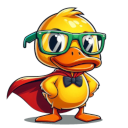

# 🦆 Quack Norris Floaty 



This code will allow you to create a floaty for wrapping a web app.
By default it will wrap the Quack Norris AI chat app.
But you can customize it via simple configuration to use any image and any url.

## 🛠️ Installation

```bash
# for server use (just backend)
pip install quack-norris

# for desktop use (includes ui)
pip install quack-norris[ui]
```


## 👨‍💻 Usage 

Run the ui from the commandline.
```bash
quack-norris-ui
```

If you want to add quack norris to the autostart or the startmenu on windows, simply find the `quack-norris-ui.exe`, wherever your python installation put it and add a **link** to it to your startmenu (in the right click settings, you can even configure an icon). You can find the startmenu here: `C:\Users\YOUR_USERNAME\AppData\Roaming\Microsoft\Windows\Start Menu\Programs\Startup`.

### 🎨 Config

Config files can be created in the current working directory or in your users config folder `~/.config/quack_norris/`.

In the `ui.json`, you can even replace the url the launcher opens as a chat app and customize the icon.
```json
{
  "url": "https://example.com/",
  "launcher_ctrl_click_to_exit": false,
  "launcher_size": [84, 84],
  "launcher_icon": "my_icon.png"
}
```

## 💡 Roadmap

- [X] A floating duck (movable)
- [X] Click opens a chat window with buttons for actions
- [ ] Allow for permanent local storage
- [ ] Allow for copy & paste via clipboard
- [ ] "Hey Quack-Norris" opens the web view and calls a function on the web-page
    - by default calls "javascript:start_call", but can be customized via config


## 👥 Contributing

Feel free to make this code better by forking, improving the code and then pull requesting.

I try to keep the dependency list of the repository as small as possible.
Hence, please try to not include unnescessary dependencies, just because they save you two lines of code.

When in doubt, if I will like your contribution, check the [.continuerules](.continuerules) for AI assistants.
The rules for AI will also apply to human contributors.

## ⚖️ License

Quack Norris Floaty is licensed under the permissive MIT license -- see [LICENSE](LICENSE) for details.
